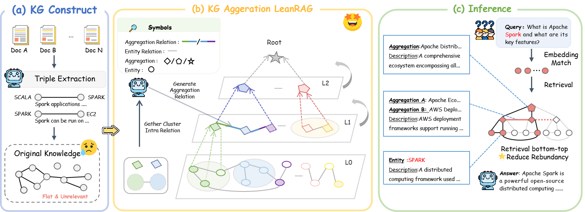
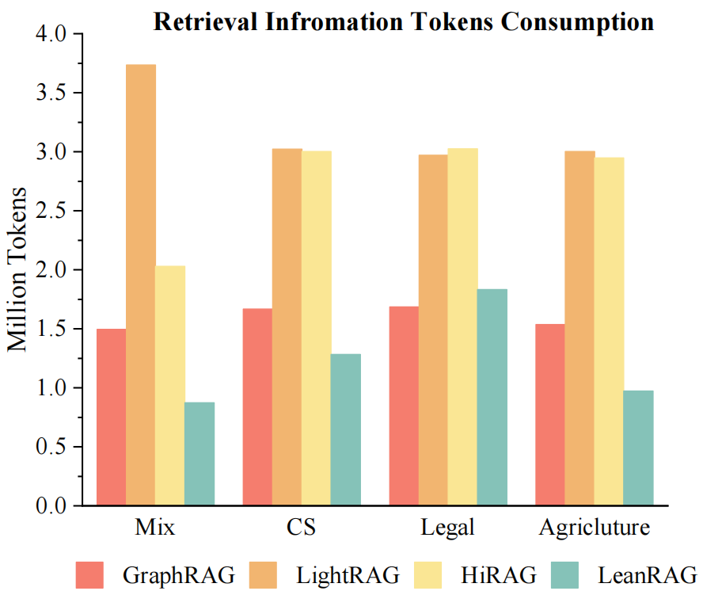

# LeanRAG: Knowledge-Graph-Based Generation with Semantic Aggregation and Hierarchical Retrieval

[](https://www.python.org/downloads/)  
[](LICENSE)  
[](https://arxiv.org/abs/2508.10391)

[](CONTRIBUTING.md)

LeanRAG is an efficient, open-source framework for Retrieval-Augmented Generation, leveraging knowledge graph structures with semantic aggregation and hierarchical retrieval to generate context-aware, concise, and high-fidelity responses.

## ✨ Features

- **Semantic Aggregation**: Clusters entities into semantically coherent summaries and constructs explicit relations to form a navigable aggregation-level knowledge network.
- **Hierarchical, Structure-Guided Retrieval**: Initiates retrieval from fine-grained entities and traverses up the knowledge graph to gather rich, highly relevant evidence efficiently.
- **Reduced Redundancy**: Optimizes retrieval paths to significantly reduce redundant information—LeanRAG achieves ~46% lower retrieval redundancy compared to flat retrieval baselines (based on benchmark evaluations).
- **Benchmark Performance**: Demonstrates superior performance across multiple QA benchmarks with improved response quality and retrieval efficiency.

## 🏛️ Architecture Overview


LeanRAG’s processing pipeline follows these core stages:

1. **Semantic Aggregation**  
   - Group low-level entities into clusters; generate summary nodes and build adjacency relations among them for efficient navigation.

2. **Knowledge Graph Construction**  
   - Construct a multi-layer graph where nodes represent entities and aggregated summaries, with explicit inter-node relations for graph-based traversal.

3. **Query Processing & Hierarchical Retrieval**  
   - Anchor queries at the most relevant detailed entities ("bottom-up"), then traverse upward through the semantic aggregation graph to collect evidence spans.

4. **Redundancy-Aware Synthesis**  
   - Streamline retrieval paths and avoid overlapping content, ensuring concise evidence aggregation before generating responses.

5. **Generation**  
   - Use retrieved, well-structured evidence as input to an LLM to produce coherent, accurate, and contextually grounded answers.

## 🚀 Getting Started

### Prerequisites

- Python 3.10+  
- Conda for environment management

### Installation

1. **Clone the repository:**
    ```bash
    git clone https://github.com/RaZzzyz/LeanRAG.git
    cd LeanRAG
    ```

2. **Create a virtual environment:**
    ```bash
    # Upgrade pip and install uv
    pip install --upgrade pip
    pip install uv

    # Create and activate a virtual environment using uv
    uv venv leanrag --python=3.10
    source leanrag/bin/activate      # For Unix/macOS
    leanrag\Scripts\activate         # For Windows

    # Alternatively, you can use conda to create and activate the environment
    conda create -n leanrag python=3.10
    conda activate leanrag
    ```

3. **Install the required dependencies:**
    ```bash
    uv pip install -e .
    ```

## 💻 Usage Workflow

Here’s a typical pipeline flow:

### **Step 1: Document Chunking**
In `file_chunk.py`, split the document into chunks:

- **Chunk size**: `1024`
- **Sliding step**: `128` (i.e., use a sliding window with step 128)

Each dictionary in the resulting `chunk` file contains two attributes:

- `hash_code`: hash calculated from the `text` content for traceability
- `text`: the chunk text content

---

### **Step 2: Extract Triples and Entity Descriptions**

Two knowledge graph extraction methods are currently provided:

#### **Method 1: CommonKG**
Based on Wikipedia entities. First, define a **head entity list**, then extract triples from the document.

**Usage:**

1. Edit the configuration file:  
   `CommonKG/config/create_kg_conf_test.yaml`  
   Fill in the model's `url` and `name`, and the path to the chunk file.
2. Run extraction:  
   ```bash
   python CommonKG/create_kg.py
   ```
   The extraction result will be saved in output_dir.
3. Process 6-tuples with descriptions:
    ```python
    python CommonKG/deal_triple.py
    ```
    Outputs include:
    - entity.jsonl
    - relation.jsonl
#### **Method 2: GraphRAG**
Relies on LLM capability to perform few-shot extraction with given examples in the prompt.

**Usage:**

1. Edit `GraphExtraction/chunk.py` to fill in url and model.
    The chunk_file is the same as in CommonKG, generated from Step 1.
2. Deduplicate extraction results:
   ```python
   python GraphExtraction/deal_triple.py
   ```
   Outputs include:
    - entity.jsonl
    - relation.jsonl

### **Step 3: Build the Graph**

```python
python build_graph.py
```

- Cluster extracted entity and relation descriptions and generate relationships.

- Construct a tree-structured knowledge graph, supporting retrieval and Q&A.

### **Step 3: Retrieval**
```python 
python query_graph.py
```
1. Select the correct chunks_file.

2. Query the graph for Top-K entities based on query.

3. Generate paths between nodes according to the tree structure.

4. Return same-level relationships and aggregated entity information along the paths to the LLM for final answer generation.


## 📊 Results & Benchmarks
On four challenging QA benchmarks spanning diverse domains, LeanRAG consistently delivers:
### Score
#### Mix

| Metric            | LeanRAG | HiRAG | Naive | GraphRAG | LightRAG | FastGraphRAG | Baseline6 |
|-------------------|-----------------|-----------|-----------|-----------|-----------|-----------|-----------|
| Comprehensiveness | **8.89±0.01**   | 8.72±0.02 | 8.20±0.01 | 8.52±0.01 | 8.19±0.02 | 6.56±0.02 | 7.90±0.03 |
| Empowerment       | **8.16±0.02**   | 7.86±0.03 | 7.52±0.03 | 7.73±0.02 | 7.56±0.03 | 5.82±0.03 | 7.41±0.04 |
| Diversity         | **7.73±0.01**   | 7.21±0.02 | 6.65±0.03 | 7.04±0.02 | 6.69±0.04 | 4.88±0.03 | 6.42±0.04 |
| Overall           | **8.59±0.01**   | 8.08±0.02 | 7.47±0.02 | 7.87±0.01 | 7.61±0.04 | 5.76±0.02 | 7.25±0.03 |

---

#### CS

| Metric            | LeanRAG | HiRAG | Naive | GraphRAG | LightRAG | FastGraphRAG | Baseline6 |
|-------------------|-----------------|-----------|-----------|-----------|-----------|-----------|-----------|
| Comprehensiveness | 8.92±0.01       | 8.92±0.01 | **8.94±0.01** | 8.55±0.02 | 8.76±0.02 | 6.79±0.01 | 8.22±0.02 |
| Empowerment       | 8.68±0.02       | 8.66±0.02 | **8.69±0.04** | 8.28±0.04 | 8.50±0.04 | 6.67±0.04 | 8.52±0.05 |
| Diversity         | **7.87±0.02**   | 7.84±0.02 | 7.79±0.02 | 7.42±0.02 | 7.63±0.04 | 5.45±0.04 | 7.03±0.02 |
| Overall           | **8.82±0.02**   | 8.77±0.02 | 8.77±0.03 | 8.37±0.04 | 8.59±0.04 | 6.31±0.03 | 7.99±0.03 |

---

#### Legal
| Metric            | LeanRAG | HiRAG | Naive | GraphRAG | LightRAG | FastGraphRAG | Baseline6 |
|-------------------|-----------------|-----------|-----------|-----------|-----------|-----------|-----------|
|-------------------|-----------------|-----------|-----------|-----------|-----------|-----------|-----------|-----------|
| Comprehensiveness | 8.88±0.02       | 8.68±0.02 | 8.85±0.01 | **8.95±0.01** | 8.24±0.02 | 3.87±0.02 | 8.41±0.02 |
| Empowerment       | **8.42±0.03**   | 8.18±0.06 | 8.28±0.03 | 8.33±0.02 | 7.83±0.05 | 3.53±0.03 | 8.20±0.03 |
| Diversity         | **7.49±0.03**   | 7.00±0.03 | 7.10±0.04 | 7.47±0.03 | 6.87±0.01 | 2.87±0.02 | 6.71±0.01 |
| Overall           | **8.49±0.04**   | 8.00±0.04 | 8.21±0.03 | 8.44±0.01 | 7.74±0.03 | 3.43±0.02 | 7.83±0.03 |

---

#### Agriculture

| Metric            | LeanRAG | HiRAG | Naive | GraphRAG | LightRAG | FastGraphRAG | Baseline6 |
|-------------------|-----------------|-----------|-----------|-----------|-----------|-----------|-----------|
| Comprehensiveness | 8.94±0.06       | **8.99±0.00** | 8.85±0.01 | 8.97±0.01 | 8.71±0.01 | 3.28±0.01 | 8.22±0.01 |
| Empowerment       | **8.66±0.02**   | 8.52±0.02 | 8.51±0.03 | 8.52±0.02 | 8.23±0.02 | 3.29±0.05 | 8.33±0.06 |
| Diversity         | **8.06±0.03**   | 7.98±0.02 | 7.76±0.06 | 7.95±0.02 | 7.68±0.03 | 3.01±0.03 | 7.07±0.02 |
| Overall           | **8.87±0.02**   | 8.87±0.03 | 8.69±0.03 | 8.85±0.01 | 8.56±0.02 | 3.17±0.02 | 7.95±0.03 |
### Winrate

#### NaiveRAG vs LeanRAG

| Metric            | Mix (NaiveRAG) | Mix (LeanRAG) | CS (NaiveRAG) | CS (LeanRAG) | Legal (NaiveRAG) | Legal (LeanRAG) | Agriculture (NaiveRAG) | Agriculture (LeanRAG) |
|-------------------|----------------|---------------|---------------|--------------|------------------|-----------------|-------------------------|-----------------------|
| Comprehensiveness | 11.9%          | **88.1%**     | 41.0%         | **59.0%**    | 30.0%            | **70.0%**       | 37.7%                   | **62.3%**             |
| Empowerment       | 1.5%           | **98.5%**     | 40.5%         | **59.5%**    | 24.5%            | **75.5%**       | 19.8%                   | **80.2%**             |
| Diversity         | 3.1%           | **96.9%**     | 28.0%         | **72.0%**    | 9.0%             | **91.0%**       | 10.0%                   | **90.0%**             |
| Overall           | 2.7%           | **97.3%**     | 39.5%         | **60.5%**    | 23.5%            | **76.5%**       | 19.3%                   | **80.7%**             |

#### GraphRAG vs LeanRAG

| Metric            | Mix (GraphRAG) | Mix (LeanRAG) | CS (GraphRAG) | CS (LeanRAG) | Legal (GraphRAG) | Legal (LeanRAG) | Agriculture (GraphRAG) | Agriculture (LeanRAG) |
|-------------------|----------------|---------------|---------------|--------------|------------------|-----------------|-------------------------|-----------------------|
| Comprehensiveness | 35.0%          | **65.0%**     | 41.0%         | **59.0%**    | 49.0%            | **51.0%**       | 45.5%                   | **54.5%**             |
| Empowerment       | 20.0%          | **80.0%**     | 33.5%         | **66.5%**    | 44.0%            | **56.0%**       | 27.0%                   | **73.0%**             |
| Diversity         | 16.5%          | **83.5%**     | 34.0%         | **66.0%**    | 44.0%            | **56.0%**       | 22.0%                   | **78.0%**             |
| Overall           | 21.9%          | **78.1%**     | 37.5%         | **62.5%**    | 47.0%            | **53.0%**       | 28.5%                   | **71.5%**             |

#### LightRAG vs LeanRAG

| Metric            | Mix (LightRAG) | Mix (LeanRAG) | CS (LightRAG) | CS (LeanRAG) | Legal (LightRAG) | Legal (LeanRAG) | Agriculture (LightRAG) | Agriculture (LeanRAG) |
|-------------------|----------------|---------------|---------------|--------------|------------------|-----------------|-------------------------|-----------------------|
| Comprehensiveness | 28.8%          | **71.2%**     | 44.5%         | **55.5%**    | 25.0%            | **75.0%**       | 38.0%                   | **62.0%**             |
| Empowerment       | 16.5%          | **83.5%**     | 35.5%         | **64.5%**    | 12.0%            | **88.0%**       | 17.0%                   | **83.0%**             |
| Diversity         | 13.1%          | **86.9%**     | 34.0%         | **66.0%**    | 40.5%            | **59.5%**       | 16.5%                   | **83.5%**             |
| Overall           | 18.8%          | **81.2%**     | 38.5%         | **61.5%**    | 21.0%            | **79.0%**       | 18.5%                   | **81.5%**             |

#### FastGraphRAG vs LeanRAG

| Metric            | Mix (FastGraphRAG) | Mix (LeanRAG) | CS (FastGraphRAG) | CS (LeanRAG) | Legal (FastGraphRAG) | Legal (LeanRAG) | Agriculture (FastGraphRAG) | Agriculture (LeanRAG) |
|-------------------|---------------------|---------------|-------------------|--------------|----------------------|-----------------|-----------------------------|-----------------------|
| Comprehensiveness | 0.0%                | **100.0%**    | 0.5%              | **99.5%**    | 1.0%                 | **99.0%**       | 0.5%                        | **99.5%**             |
| Empowerment       | 0.0%                | **100.0%**    | 0.0%              | **100.0%**   | 0.5%                 | **99.5%**       | 0.0%                        | **100.0%**            |
| Diversity         | 0.0%                | **100.0%**    | 0.8%              | **99.2%**    | 2.5%                 | **97.5%**       | 0.0%                        | **100.0%**            |
| Overall           | 0.0%                | **100.0%**    | 0.0%              | **100.0%**   | 4.5%                 | **95.5%**       | 0.0%                        | **100.0%**            |

#### KAG vs LeanRAG

| Metric            | Mix (KAG) | Mix (LeanRAG) | CS (KAG) | CS (LeanRAG) | Legal (KAG) | Legal (LeanRAG) | Agriculture (KAG) | Agriculture (LeanRAG) |
|-------------------|-----------|---------------|----------|--------------|-------------|-----------------|--------------------|-----------------------|
| Comprehensiveness | 1.5%      | **98.5%**     | 5.0%     | **95.0%**    | 5.0%        | **95.0%**       | 2.5%               | **97.5%**             |
| Empowerment       | 1.9%      | **98.1%**     | 3.0%     | **97.0%**    | 4.5%        | **95.5%**       | 2.5%               | **97.5%**             |
| Diversity         | 1.2%      | **98.8%**     | 4.0%     | **96.0%**    | 2.5%        | **97.5%**       | 1.0%               | **99.0%**             |
| Overall           | 1.2%      | **98.8%**     | 3.5%     | **96.5%**    | 4.5%        | **95.5%**       | 1.0%               | **99.0%**             |

#### HiRAG vs LeanRAG

| Metric            | Mix (HiRAG) | Mix (LeanRAG) | CS (HiRAG) | CS (LeanRAG) | Legal (HiRAG) | Legal (LeanRAG) | Agriculture (HiRAG) | Agriculture (LeanRAG) |
|-------------------|-------------|---------------|------------|--------------|---------------|-----------------|----------------------|-----------------------|
| Comprehensiveness | 43.8%       | **56.2%**     | 46.5%      | **53.5%**    | 29.5%         | **70.5%**       | 49.5%                | **50.5%**             |
| Empowerment       | 26.5%       | **73.5%**     | 43.5%      | **56.5%**    | 16.5%         | **83.5%**       | 26.5%                | **73.5%**             |
| Diversity         | 20.4%       | **79.6%**     | 44.5%      | **55.5%**    | 23.5%         | **76.5%**       | 23.5%                | **76.5%**             |
| Overall           | 28.1%       | **71.9%**     | 45.0%      | **55.0%**    | 21.5%         | **78.5%**       | 28.0%                | **72.0%**             |
### Tokens Consumption

## 📄 Citation

If you find LeanRAG useful, please cite our paper:
```bitex
@misc{zhang2025leanragknowledgegraphbasedgenerationsemantic,
      title={LeanRAG: Knowledge-Graph-Based Generation with Semantic Aggregation and Hierarchical Retrieval}, 
      author={Yaoze Zhang and Rong Wu and Pinlong Cai and Xiaoman Wang and Guohang Yan and Song Mao and Ding Wang and Botian Shi},
      year={2025},
      eprint={2508.10391},
      archivePrefix={arXiv},
      primaryClass={cs.AI},
      url={https://arxiv.org/abs/2508.10391}, 
}
```